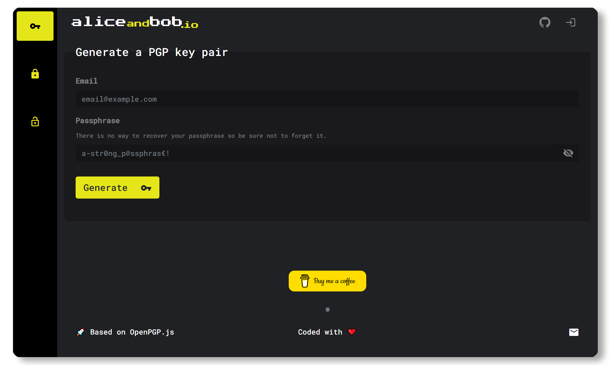

# aliceandbob.io 🌐🔐

A free, light and easy to use client-side tool to generate PGP key pairs, encrypt and decrypt messages.

**⚡ Looking for the Desktop App from aliceandbob.io instead? Go [here](https://aliceandbob.io/) or on its [GitHub's page](https://github.com/aliceandbob-io/aliceandbob-desktop).**

## Check it out! 🔥

[aliceandbob.io](https://aliceandbob.io/)

## Features ✨

- 🗝️ Generate PGP key pairs
- 🔒 Encrypt messages with the public PGP key of the receiver
- 🔓 Decrypt messages with your private PGP key

## Tech 🔧

- HTML/CSS
- Ruby (v2.6.5)
- Rails (v6.0.3.2)
- Stimulus JS (v1.1.1)

## Library 📚

OpenPGP.js (v4.10.7), a JavaScript implementation of the OpenPGP protocol. Find out more on [openpgpjs.org](https://openpgpjs.org/).

## Contributing 🍰

Please contribute using [GitHub Flow](https://guides.github.com/introduction/flow). Refer first to the open issues then create a branch, add commits, and open a pull request!

You can also read the [`CODE OF CONDUCT`](CODE_OF_CONDUCT.md).

When forking and cloning the repo, don't forget to do the following:
1. `yarn install --check-files`
2. `bundle install`
3. Duplicate the `database.yml.template` file and rename it `database.yml`
4. Update the `database.yml` file as needed to match your configuration
5. Then, `rails db:setup`.

## Do you like this app? ❤️

## License 📄

Licensed under the [MIT License](https://github.com/aliceandbob-io/aliceandbob.io/blob/master/LICENSE).
